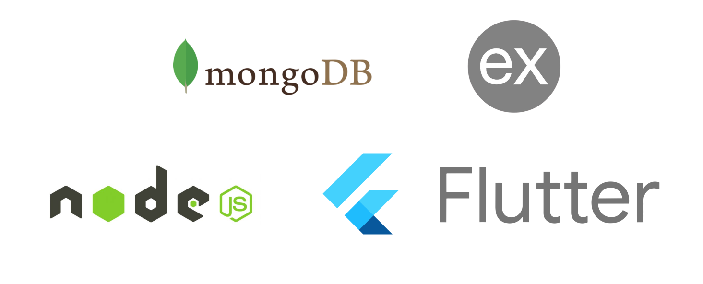

# Genix Auctions


Welcome to Genix Auctions, a comprehensive online auction platform that allows users to participate in an engaging and dynamic bidding system. This full-stack web application is built with MongoDB, Express, and NodeJs for the backend, and Flutter for the frontend. The frontend and backend communicate via HTTPS requests, ensuring secure and efficient data exchange.

## Project Overview

The primary goal of this project is to build a complete web application that includes:

- User authentication
- Auction item listing
- Bidding functionality
- A user-friendly interface for managing and viewing bids

This application is designed to demonstrate the ability to design, implement, and document a full-stack web application.

## Technologies Used



## Features

### User Authentication

- **Sign Up:** Users can register with a username, email, and password.
- **Log In:** Users can log in with their email and password.
- **Password Management:** Secure password handling using bcrypt for hashing and JWT for authentication.

### Auction Management

- **Create Auction Items:** Users can create auction items with a title, description, starting bid, and end date.
- **View Auction Items:** Users can browse all available auction items.
- **Update Auction Items:** Users can update their auction items to correct mistakes or add new information.
- **Delete Auction Items:** Users can remove items they no longer wish to sell.

### Bidding Functionality

- **Place Bids:** Users can place bids on auction items.
- **View Bids:** Users can view the current highest bid and bid history for auction items.
- **Outbid Notifications:** Users receive notifications when they are outbid.

### User Interface

- **Home Page:** Displays a list of auction items with their current highest bids for quick browsing.
- **Auction Item Page:** Shows detailed information and bid history for auction items.
- **Profile Page:** Allows users to manage their information and view their auction activities.

## Security

- **Password Hashing:** Using bcrypt for secure password hashing.
- **Authentication:** Secure handling of user authentication with JWT.

## Website Screenshots

.png)
.png)
.png)
.png)
.png)
.png)
.png)

## Getting Started

To get started with the project, follow these steps:

1. **Clone the repository:**
   ```bash
   git clone https://github.com/yourusername/genix-auctions.git
   ```

2. **Install backend dependencies:**
   ```bash
    cd backend
    npm install
    ```

3. **Start the backend server:**
   ```bash
   npm start
   ```

4. **Install frontend dependencies:**
   ```bash
    cd frontend
    flutter pub get
    ```

5. **Run the Flutter app:**
   ```bash
   flutter run
   ```
